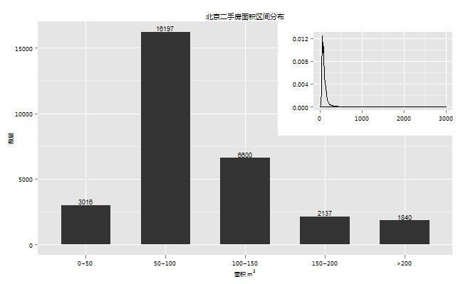
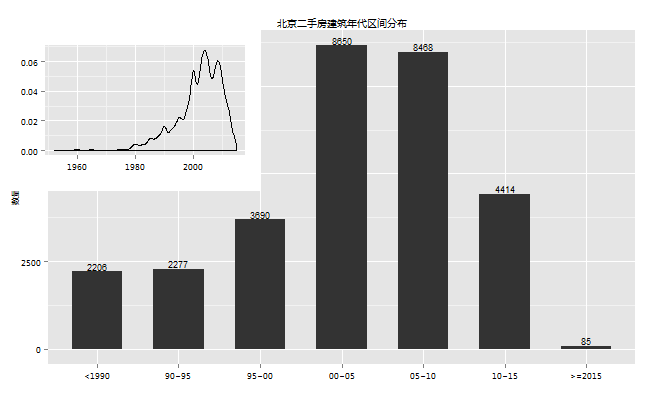
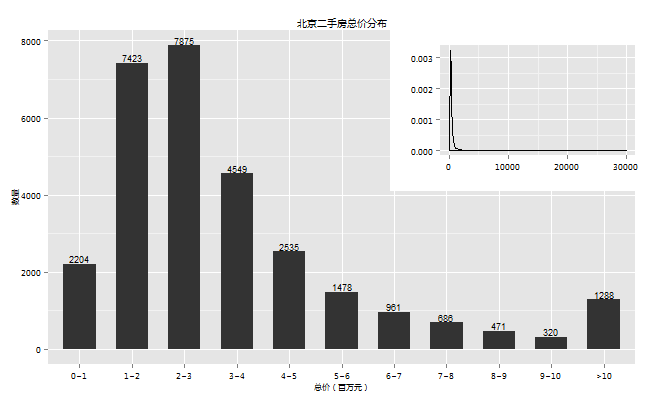
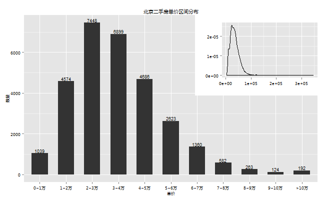

> 最近忙活了一阵子，终于把房子的事情落实了，俗话说饱暖思淫欲，某天突发奇想能不能利用手头上的一些工
> 具对北京的二手房数据捣鼓一下，看看能不能有一些有意思的发现？想到以前有点python经验，正巧最近也在
> 看R，正好借此机会巩固一下，齐活，走起！

### 一、数据准备

看了下各大房产网站，从数据的量级、真实性、即时性等方面对比了下，有的数据挺多，但是数据真实性不高，上面既有房主的帖子，也有中介的帖子；有的真实性不错，但是房源太少，综合对比下来，最终选择了某家网。

有了数据源，用Python写了一个爬虫，从网站上随机爬取了30000条房源数据。有人可能说数据太少了，少就少吧，这里只是想起到一个抛砖引玉的作用。

### 二、数据整理

来看下获取的数据，每条数据描述了房子的13个属性，分别为：区、小区、户型、面积、朝向、区域（区下面更细分的一级，比如昌平的天通苑、回龙观）、楼层、房龄、学区、地铁、税、总价、单价。

1. 区，原始数据都是英文代号，比如BJCP代表昌平，BJCY代表朝阳，为了查看起来方便，将它们都替换为相应的中文名。
2. 楼层，原始数据大部分是以“低楼层”、“中楼层”这样的楼层区间划分的，不过有少量数据也写了具体楼层，我统一把它替换为楼层区间。
3. 学区和地铁，我进行了简化，只进行了是否学区、是否地铁的划分，对于学区的品质，地铁的远近没有细分。
4. 税，抓取的30000条数据里面很奇怪只有“满五唯一”和空值这两种，并没有例如“满二不唯一”、“满二唯一”等类型，为了简化，就认为空值没有免税。
5. 对异常值的处理，查看了一下数据，通过与网站上同区域同小区的数据对比，有一些年代过早、总价、单价过高过低等异常情况，比如年代为1000年的房子，总价43亿的“西山小镇”等等，这可能是信息录入员笔误或者采用了默认值造成，由于异常值占比较小，我进行了简单的删除处理。
6. 为了对面积、年代这样的连续值进行分组，我增加了四列，
    + 面积分组：0~50, 50~100, 100~150, 150~200, >200
    + 年代分组：<1990, 90~95, 95~00, 00~05, 05~10, 10~15, >=2015
    + 总价分组：0~1, 1~2, 2~3, 3~4, 4~5, 5~6, 6~7, 7~8, 8~9, 9~10, 
    >10，单位为百万
    + 单价分组：0~1万, 1~2万, 2~3万, 3~4万, 4~5万, 5~6万, 6~7万, 7~8万, 8~9万, 
    9~10万, >10万

```{r, echo=F}

library(ggplot2)
library(plyr)
setwd("F:/R/workspace/2ndhand_house")
source("R/topn.R")


load("data/houses_30000.RData")
# Window Fonts
windowsFonts(HEL = windowsFont("Helvetica CE 55 Roman"),
             RMN = windowsFont("Times New Roman"),
             ARL = windowsFont("Arial"),
             MS = windowsFont("微软雅黑")
             )
# My theme
mtm <- theme(plot.title = element_text(color = "black", size = I(10), family = "MS"),
             axis.text = element_text(color = "black", size = I(7.5), family = "MS"),
             axis.title = element_text(color = "black", size = I(8), family = "MS"),
             legend.text = element_text(color = "black", size = I(7), family = "MS"),
             legend.title = element_text(color = "black", size = I(8), family = "MS")
             )
# Bar label 垂直
bar_label_v <- geom_text(aes(label = count), vjust=-0.2, size = I(3))
# Bar label 水平
bar_label_h <- geom_text(aes(label = count), hjust=-0.1, size = I(3))
# Boxplot 均值点
bmean <- stat_summary(fun.y="mean", geom="point", shape=19, size=3, color = "red")
```

整理完共有29790条数据，这是数据的结构：

```{r, echo=FALSE}

str(houses)

```

### 三、数据概览

下面从总体上看下数据，

1. 县区分布

```{r 二手房的各区分布, echo=FALSE}

area_count = ddply(houses, .(area), summarise, count = length(area))

p <- ggplot(area_count, aes(reorder(area, count), count))
p + mtm + bar_label_v +
    geom_bar(stat = "identity") + 
    ggtitle("北京二手房各区数量分布") + xlab("") + ylab("数量")

```

本次抽到的数据包括北京13个区和2个特别区域亦庄和燕郊，后两个地方不是区，但是在北京的朋友都知道，这两个地方有可能比某些区还有名。

总体来看市区的二手房市场比较活跃，可以看到朝阳、海淀、丰台分列三甲，三个区的二手房之和几乎占去了北京二手房一半的数量，朝阳一个区的岀房量更是比后两名都多。昌平区和燕郊紧随其后，昌平区有天通苑和回龙观这两个人口聚集区（这个后面会看到），而燕郊满足了一些在城区无法买房，又要在市区工作的人的需求，二手房数量也是不容小觑。

2. 户型分布

```{r 户型分布, echo=F}

# 户型分布
zone_count = ddply(houses, .(zone), summarise, count = length(area))
zone_count = zone_count[order(-zone_count$count), ][1:10, ]
p <- ggplot(zone_count, aes(reorder(zone, count), count))
p + mtm + bar_label_v +
    geom_bar(stat = "identity", width = I(0.618)) + 
    ggtitle("北京二手房top10户型") + xlab("") + ylab("数量")

```

最多的是两室一厅，占到33%，然后是一室一厅、三室两厅、三室一厅这样的户型。

看来小户型还是主流，不过这有可能因为一是大部分二手房年代较早，小户型较多,不过查看了下数据，2000年以后的房子二室一厅也有26%；另外一点可能是北京房价太贵，作为购房者的主体普通大众大部分购买力有限，开发商盖房的时候主要盖的就是这种户型。

3. 面积分布

```{r 面积分布, echo=F, fig.show="hide"}


# 面积分布
p <- ggplot(houses, aes(meters))
p + mtm + geom_density() +
    ggtitle("北京二手房面积概率密度") + 
    xlab(expression(paste("面积 ", m^2))) + ylab("密度")

meters_cg_count = ddply(houses, .(meters_cg), summarise, count = length(meters_cg))
p <- ggplot(meters_cg_count, aes(meters_cg, count))
p + mtm + bar_label_v +
    geom_bar(stat = "identity", width = I(0.618)) + 
    ggtitle("北京二手房面积区间分布") + xlab(expression(paste("面积 ", m^2))) + ylab("数量")

```



右上角密度图显示本次抽取的数据，面积的区间为0 ~ 3000平方，不过大部分的房子的面积还是集中在一个
较小的范围内。从下图可以看到大部分面积都落在50 ~ 150这个区间，50 ~ 100的房子约为54%，而200平米
以上的大房子仅为6%。

不太清楚其他地方的房子，在北京房子的面积和要交的税是有关系的。这可能在一定程度上会遏制房子的面积。

4. 朝向分布

```{r 朝向分布, echo=F}

# 朝向分布
direction_count = ddply(houses, .(direction), summarise, count = length(direction))
direction_count = direction_count[order(-direction_count$count), ][1:10, ]

p <- ggplot(direction_count, aes(reorder(direction, count), count))
p + mtm + bar_label_v +
    geom_bar(stat = "identity", width = I(0.618)) + 
    ggtitle("北京二手房top10朝向") + xlab("") + ylab("数量")
```

买过房的都知道，朝向很重要。什么东西向的只有早晚才能见阳光，北向的天天喝西北风，衣服都晒不干，还有一些风水上的讲究就更复杂了，反正我是不懂，凡此种种，充分说明了买房者对朝向的注重。

由于朝向比较多，这里只挑选了数量最多的10种。从图上我发现南北向、南向这些大家都比较喜欢的朝向竟然最多，二者合起来约有61%，这点和自己的看房经历不太一样，咋看有点不可思议，细想原因可能是这样的，一般楼房建设的时候，都是南北朝向的，我想没有哪个傻帽故意把房子盖成朝北的，盖好以后一些边角没有办法，朝向为东西、北等等，所以主体还是南北。

5. 区域分布

```{r 区域分布, echo=F}
con_count = ddply(houses, .(con), summarise, count = length(con))
con_count = con_count[order(-con_count$count), ][1:10, ]

p <- ggplot(con_count, aes(reorder(con, count), count))
p + mtm + bar_label_h +
    geom_bar(stat = "identity", width = I(0.618)) + 
    ggtitle("北京二手房数量top10区域") + xlab("") + ylab("数量") +
    coord_flip() + ylim(0, 3000)

```

由于区域众多，我这里只选择了出房量最多的10个区域。从上图可以看到，二手房数量最多的10个区域恰恰也是北京人口较为密集的区域，10个区域朝阳3个，昌平2个，房山1一个，顺义1个，门头沟1个，石景山1个，燕郊1个。

前面我们看到，北京二手房数量以朝阳为最，朝阳以望京为最，望京一个区域占了朝阳12%的房产数量。而天通苑、回龙观也不负众望，分别为第三和第四，另外如良乡、顺义城等我们熟知的人口聚居区交易也异常火爆，假如岀房量能在一定程度上代表交易量的话。

6. 楼层分布

```{r 楼层分布, echo=F}

floor_count = ddply(houses, .(floor), summarise, count = length(floor))

p <- ggplot(floor_count, aes(reorder(floor, count), count))
p + mtm + bar_label_v +
    geom_bar(stat = "identity", width = I(0.618)) + 
    ggtitle("北京二手房楼层数量分布") + xlab("") + ylab("数量")
```

买房者对楼层的重视也是不言而喻，众所周知，顶层和低层的房子一般人都不太喜欢，顶层房子冬天冷夏天热，低楼层比较潮湿等等，这两种房子住起来不是那么舒服，所以我原本以为卖房的大部分是这两种楼层。

不过从数据上看，楼层分布比较平均，这点也和自己的看房经历不太一样，从自己的看房经历来看中楼层较少，大部分的二手房都是高楼层或者低楼层。原因可能和楼层的划分有关系，比如一座20层的楼房，1 ~ 5为低层，6 ~ 15为中层，16 ~ 20为高层，这样中楼层就比较多了。

7. 建筑年代分布

```{r 建筑年代分布, echo=F, fig.show="hide"}

p <- ggplot(houses, aes(year))
p + mtm + geom_density() +
    scale_x_continuous(breaks = seq(1950, 2015, 5)) +
    ggtitle("北京二手房建筑年代概率密度") + 
    xlab("") + ylab("密度")

year_cg_count = ddply(houses, .(year_cg), summarise, count = length(year_cg))
p <- ggplot(year_cg_count, aes(year_cg, count))
p + mtm + bar_label_v +
    geom_bar(stat = "identity", width = I(0.618)) + 
    ggtitle("北京二手房建筑年代区间分布") + xlab("") + ylab("数量")

```



房子的建筑年代对于土豪不是那么重要，但是对于普通购房者就不一样了，因为贷款的年限和房龄是有关系的。一般情况下钢混结构带电梯的贷款年限为57减去房龄，砖结构比如6层不带电梯的板楼是45减去房龄，具体的年限和你的房屋具体评估值有关系，我在网上找了半天，没有找到这种算法的明文规定，这应该是一个经验值，不过具有一定的准确性。也就是说你想贷款30年，钢混的必须至少为88年后的，砖混的必须至少是2000年后的。

数据显示，建筑年代区间为1952 ~ 2015，从图中可以看到，建筑年代主要集中在1995年到2015年这个时间段，
2000年后的房子竟然占了总量的72%。这是我没有想到的，因为看房的时候，看到的房子基本上都是90年代的房子，这可能和当初我的定位有关系，当初买房的时候就想买个离市区近点的，上班方便，房子老点没关系，而市区可能新房子较少。

8. 学区房、地铁房、免税房

```{r 学区房地铁房, echo=F, fig.show="hide"}

# 学区
school_count = ddply(houses, .(school), summarise, count = length(school))
p <- ggplot(school_count, aes(school, count))
p + mtm + bar_label_v +
    geom_bar(stat = "identity", width = I(0.618)) + 
    ggtitle("北京二手房学区分布") + xlab("") + ylab("数量")
# 地铁
subway_count = ddply(houses, .(subway), summarise, count = length(subway))
p <- ggplot(subway_count, aes(subway, count))
p + mtm + bar_label_v +
    geom_bar(stat = "identity", width = I(0.618)) + 
    ggtitle("北京二手房地铁分布") + xlab("") + ylab("数量")
# 税费
tax_count = ddply(houses, .(tax), summarise, count = length(tax))
p <- ggplot(tax_count, aes(tax, count))
p + mtm + bar_label_v +
    geom_bar(stat = "identity", width = I(0.618)) + 
    ggtitle("北京二手房税费分布") + xlab("") + ylab("数量")


```


这三个属性有点相似，放在了一起。这里没有对学区的优劣，地铁的远近等进行细分，只是简单粗暴的分为有无两种。

从图上可以看到学区的差异性较大，学区房只占总量的20%，怪不得学区房这么贵了；而地铁就较为普遍了，随着北京城市交通的建设地铁越来越多，表现在住房上就是地铁房的比例越来越高，约占41%，相信随着城市的发展，这个比例会越来越高。

税费这一项对于普通购房者也很重要，例如满五唯一只有1%的契税，满二唯一还要加收差价20%的个税，具体的费率和是否首套，房屋面积也有一定的关系，买房的朋友可以去查查。

数据显示，满五唯一的房子约为38%，比例不算低，看来，虽说大部分的房子都是2000年后的房子，有相当一部分的人还是在房子满五年之后再出售，虽然房主可以把税费转移到购房者身上，但是定价太高，房屋就不好出了，所以国家的征税政策对房产的恶意交易是有一定的作用的。

9. 总价分布

```{r 总价分布, echo=F, fig.show="hide"}

p <- ggplot(houses, aes(num))
p + mtm + geom_density() +
    # scale_x_continuous(breaks = seq(0, 1000, 50)) +
    # coord_cartesian(xlim = c(0, 1000)) +
    ggtitle("北京二手房总价概率密度") + 
    xlab("总价（万元）") + ylab("密度")

num_cg_count = ddply(houses, .(num_cg), summarise, count = length(num_cg))
p <- ggplot(num_cg_count, aes(num_cg, count))
p + mtm + bar_label_v +
    geom_bar(stat = "identity", width = I(0.618)) + 
    ggtitle("北京二手房总价分布") + xlab("总价（百万元）") + ylab("数量")

```



对于总价和单价两种数据，我都是抱着猎奇的态度看待的，不过这两个数据的重要性自不必说，特别是总价，因为这关系到你的预算。看密度图（单位为万元），还真有3亿元的房子，我应该没数错0的个数，不过好在这样的房子只是凤毛麟角，让我等凡人还有些念想。

从直方图上可以看出100 ~ 300万的房子大概有50%，不过大于500万的房子也占到了17%，还得好好努力挣钱啊。

10. 单价分布

```{r 单价分布, echo=F, fig.show="hide"}

p <- ggplot(houses, aes(price))
p + mtm + geom_density() +
#     scale_x_continuous(breaks = seq(0, 1000, 50)) +
#     coord_cartesian(xlim = c(0, 1000)) +
    ggtitle("北京二手房单价概率密度") + 
    xlab("单价（万元）") + ylab("密度")

price_cg_count = ddply(houses, .(price_cg), summarise, count = length(price_cg))
p <- ggplot(price_cg_count, aes(price_cg, count))
p + mtm + bar_label_v +
    geom_bar(stat = "identity", width = I(0.618)) + 
    ggtitle("北京二手房单价区间分布") + xlab("单价") + ylab("数量")

```



单价对于普通购房者可能不够直接，因为在我看来，一般人买房之前先确定了总价，也就是自己能拿出多少钱，然后再结合自己大致的需求，比如想要一个多大的，什么户型的等等，总价和需求定了基本上能购买的单价也就定了，也就是说单价影响你选择的余地，比如说你本来想买个100平方的，你在看房过程中特别中意一个小区，那个小区单价贵，你能拿出的钱就那些，那你只能换一个小点的房子了。

密度图（单位元）显示还有30万一平方的房子，赶紧看看是何方宝地，原来是两套5平方的学区房，好吧，喝口水压压惊。不过好在单价主要还是集中在1 ~ 5万的区间，约占80%，其中2 ~ 4万最多，约为总量的50%。

上面大致看了下数据的总体情况，并尝试对一些原因做了分析，当然有些只是推测，这段时间比较忙，正好趁阅兵放假的时间看看能不能从数据中发现一些有利的证据。


