# 当Python和R遇上北京二手房（下）

### 四、各区情况

作为买房者第一步就是看房选房，那么各区的情况是怎样的呢？下面从买房者比较注重的五个方面横向对比一下。

1.各区总价

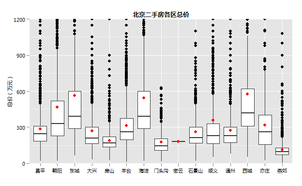 

（图中红点为本区域的均值）

果然不出所料，西城、东城、海淀、朝阳四区均值和中位数均在前列，且数据区间分布比较广，而一些新兴的郊区如房山、门头沟、燕郊总价则较为集中，大概是因为房子是同一时期建设，功能需求也比较单一的缘故。

另外我注意到，各区的总价均值均不同程度的偏离中位点，城区偏离较大，郊区偏离较小，是不是因为城区房子需求多样，一些别墅豪宅拉高了均值？值得注意是顺义的均值超过了上四分位数，是不是顺义有较大比例的高档房产呢？

下面换个角度，以二维直方图来展示下

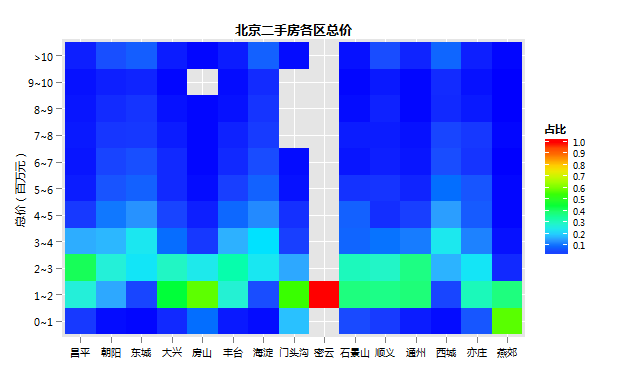 

由于各区二手房总量差异较大，这里的颜色代表的是总价区间在本区的占比，从这张图上可以看到西城、东城、海淀、朝阳、顺义确实有一定数量的千万房产。

2.各区单价

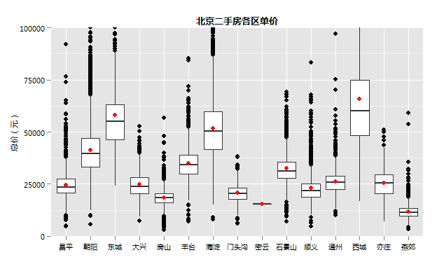 

这张图很有意思，能发现很多东西。

第一，市区的房价高，郊区房价低，这傻子都知道，呵呵。第一梯队东西城、海淀50%的房子单价都在5万以上，想买这些地方的房子，看看腰包鼓不鼓，第二梯队朝阳、丰台、石景山大部分房子都在3万以上，第三梯队剩下的区房价大部分都在2万5以下，燕郊最低，基本上在1万2左右；

第二，市区的房价范围广，均值偏离中位数幅度大，比如东西城，应该是这两区一些高质量的学区房导致。

3.各区面积

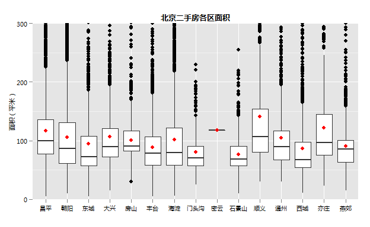 

（图中红点为本区域的均值）

可以看出一个趋势，郊区的房子要比市区的房子大。例如东西城面积中位数在75平米左右，而昌平、亦庄等均在100平米左右。还有就是市区房子面积范围较大，而郊区可能起步较晚，基本上建筑年代都在同一时期，房子的面积也较为单一。

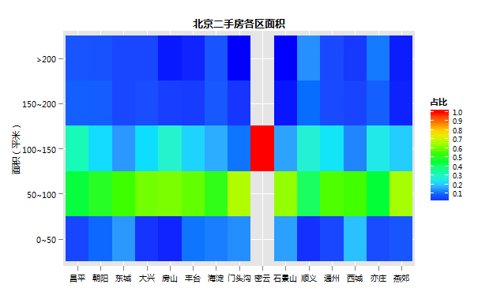 

顺义200平米的房子比例不少，再结合其千万以上的总价，看来顺义卧虎藏龙。

4.各区建筑年代

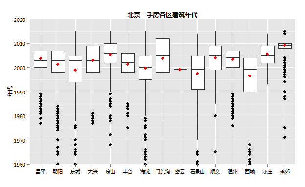 

这张图上印证了上面的猜测，昌平、房山、亦庄、通州、燕郊等郊区房子建筑年代较为集中，尤其是燕郊，基本上都是2010年左右的房子，而最近因市政府东迁而大火的通州75%的房子是2000年后。而东西城、海淀等区域则是各个年代的房子都有。

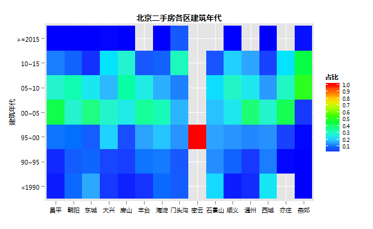 

从这张图似乎更能明显的看出，昌平、通州、亦庄、燕郊都有一些颜色较深的色块。大兴、房山、顺义、亦庄、燕郊均有超过20%的2010年后的房子，东城、石景山、西城则有20%的90年以前的老房子。

5.各区学区

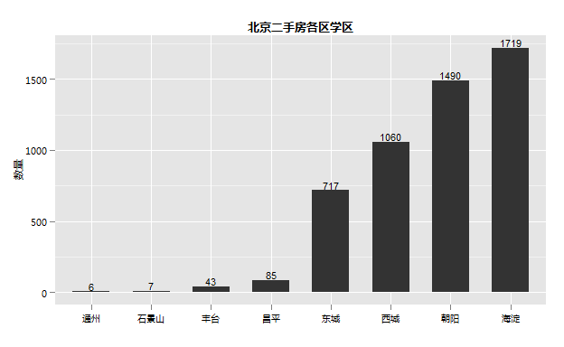 

再来看一下喜闻乐见的学区房，不出所料，海淀区的学区房最多，朝阳区学区次之。由于没有对学区的质量进行分类，东西城这两区虽然数量不如前两者，但是从质量上这两区应该是不言而喻的。

上面，从5个方面分区域做了一下比较，总结一下，喜欢新房的多去昌平通州等区走走，想要学区房的海淀、朝阳是你的选择，如果你只想最贵的，那么东城、西城是你的不二之选，如果你是土豪，顺义是个好去处。

### 五、一些有意思的事

1.房子是不是随着时代的发展越来越大了呢？

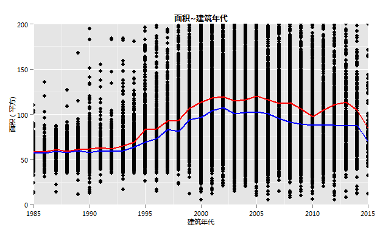 

因为大部分房子都在1985 ~ 2015这个时间段，我将视角集中在这个时间段。图中红线为均值，
蓝线为中位数。

从图上可以很清楚的看出在1995年房屋面积有一个很明显的上扬，到2000年左右保持平稳，从之前的60平到100平，从2005年开始又有小幅度的下降，难道是刚开始起高了？还有一点是，1995年前的房子，均值和中位数基本持平，95年之后均值大于中位数10个平方左右，是否可以得出以前我们都是无产阶级，现在确实有一部分先富起来了哈哈。

看来，随着时代的发展房屋面积确实有了不小的增长，希望随着时代的进步，人人都能住得起大房子。

2.学区房房价要比非学区贵多少呢？

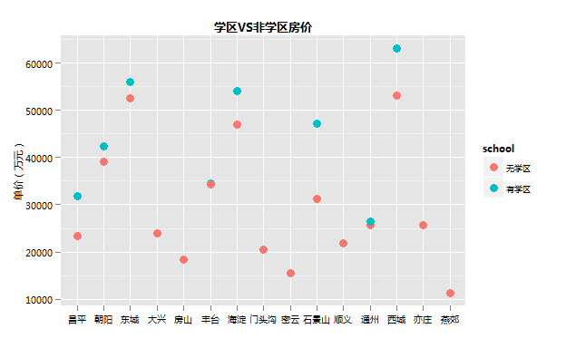 

数据显示，各个区学区房房价确实要比非学区贵一些，这个差距大概在5000 ~ 15000左右,石景山、西城这个差距
较大，都在10000以上，昌平和海淀稍微低些，大约每平方相差8,9千，朝阳东城相差的不多，丰台通州几乎持平。

3.那些地方房价最贵？

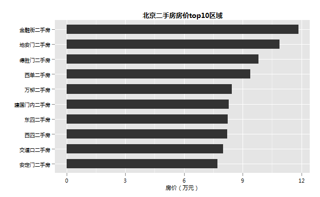 

这些房价最贵的地方除万柳其余都在二环以里，基本上分布在北京最中心的地带，果然寸土寸金啊。

4.哪些地方千万豪宅最多？

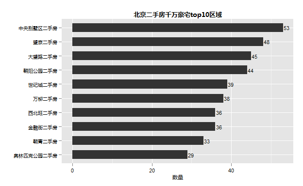 

而一些豪宅就不一样了，除金融街其余都在三环以外。这也难怪，三环里面就那么点地方，早就占满了，想要豪宅就得往郊区盖，比如中央别墅区、西北旺都在五环以外。

5.哪些地方学区最多呢？

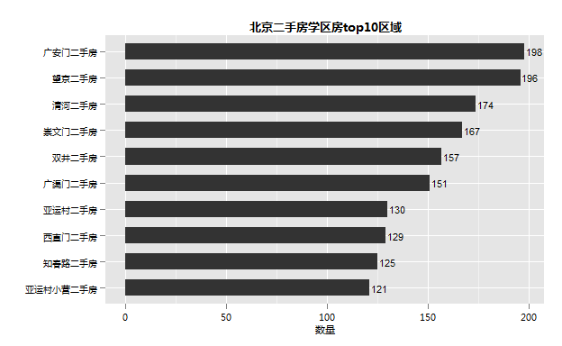 

学区最多的十个区域，朝阳四个，海淀两个，西城两个，东城两个。

### 六、总结

通过两篇文章，我尝试对北京二手房的一些特点进行了分析，分析很初级，基本上就是统计个数量或者比例，对于一些高大上的统计分析方法也在学习当中，等学的差不多了，再补上。

说句题外话，即便是最简单的数据展示和统计分析也能让人学到不少东西，当你着手开始做的时候，你会碰到各种各样的问题，小到图形的字体怎么调整、图形的legend如何改变，大到一些统计方法的实用、数据的处理方法等，鼓励大家根据自己的兴趣，自己动手整一个小的数据集，在这个基础上有目的的进行学习，有道是，当你上路了，你就已经进步了。
